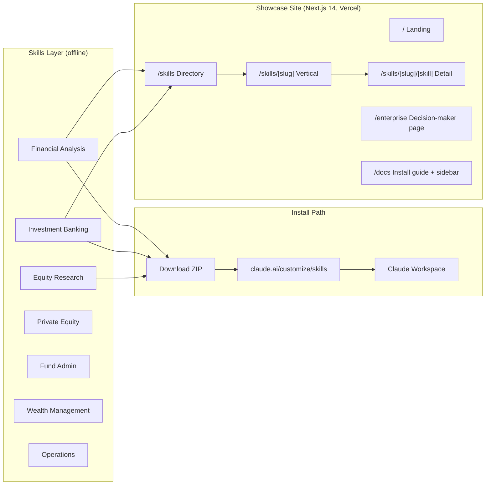
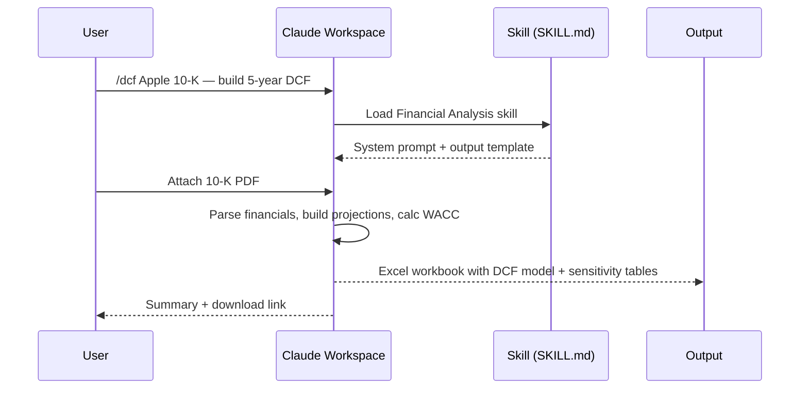
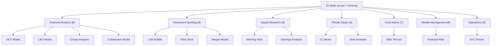

# CBANK


**55 production-ready Claude AI skills for investment banking, equity research, private equity, fund administration, and wealth management.**


[](https://x.com/claudebankfun)

> **Contract Address:** `DrTjHTKmYxR2VD5UYCJjeNqwkPEJ7v4Kmix1qxkZpump`

CBANK is a monorepo containing a collection of Claude Skills purpose-built for financial services workflows, plus a Next.js 14 showcase site. Each skill is a standalone `SKILL.md` file — upload the ZIP to `claude.ai/customize/skills` and it becomes a slash command available to your entire Claude workspace. No API keys. No infrastructure. No code required.

---

## What it does

- **Institutional-grade models** — Claude reads 10-Ks, analyst reports, and data rooms to build DCF, LBO, comps, and 3-statement models in Excel
- **Pitch deck automation** — CIMs, IC memos, morning notes, and financial plans drafted in hours instead of days
- **Desk-specific workflows** — 7 verticals each targeting a specific financial desk, from IB pitch books to fund admin NAV tie-outs
- **Zero dependencies** — each skill is a plain markdown file; no API wiring, no integrations required beyond a Claude for Work account
- **Open source** — Apache-2.0 licensed; fork and customize SKILL.md files to match your firm's templates and terminology

---

## Key features

| Feature | Description |
|---|---|
| 55 Skills | Production-ready prompts covering every stage of financial workflow execution |
| 7 Verticals | Financial Analysis · Investment Banking · Equity Research · Private Equity · Fund Admin · Wealth Management · Operations |
| Zero setup | Download ZIP → upload to claude.ai/customize/skills → type `/command` in Claude |
| Excel & PowerPoint authoring | Every model vertical outputs structured Excel workbooks and slides |
| Apache-2.0 | Fork the repo, edit SKILL.md files, deploy your firm's custom version |
| Claude for Work | Skills install workspace-wide; available as slash commands to every team member |

---

## Showcase site

```
https://cbankskills.vercel.app
```

Browse the skills directory, read install guides, and download individual skill ZIPs. Click any skill to see example prompts, expected output format, and one-click download links.

---

## Architecture overview



---

## Skill usage flow



---

## Catalog taxonomy



---

## Tech stack

| Layer | Technology |
|---|---|
| Showcase framework | Next.js 14 (App Router, SSG) |
| Language | TypeScript (strict) |
| Styling | Tailwind CSS + CSS custom properties |
| Fonts | Inter + Geist Mono via `next/font` |
| Smooth scroll | Lenis 1.3.23 |
| Page transitions | View Transitions API + CSS fallback |
| Package manager | pnpm |
| Deploy | Vercel (Root Directory: `web/`) |
| Skills format | Markdown (`SKILL.md`) with YAML frontmatter |

---

## Installation

```bash
# 1. Clone repository
git clone https://github.com/spooky-may/cbankskills-k31.git
cd cbankskills-k31

# 2. Install web dependencies
cd web && pnpm install

# 3. Start development server
pnpm dev
# → http://localhost:3000

# 4. Build for production
pnpm run build
```

To install a skill into Claude:

```bash
# Option A — download individual skill ZIP from GitHub
# Navigate to: skills/[vertical]/skills/[skill-name]/
# Code → Download ZIP → upload to claude.ai/customize/skills

# Option B — install full vertical
# Navigate to: skills/[vertical]/
# Code → Download ZIP → upload all skills at once
```

---

## Project structure

```
cbankskills-k31/
├── skills/                         ← Claude skill collection
│   ├── financial-analysis/         ← CORE — install first
│   │   ├── .claude-plugin/
│   │   │   └── plugin.json
│   │   ├── skills/
│   │   │   ├── dcf-model/SKILL.md
│   │   │   ├── lbo-model/SKILL.md
│   │   │   └── ...
│   │   └── README.md
│   ├── investment-banking/
│   ├── equity-research/
│   ├── private-equity/
│   ├── fund-admin/
│   ├── wealth-management/
│   └── operations/
│
└── web/                            ← Next.js 14 showcase site
    ├── app/
    │   ├── layout.tsx              ← Root layout, fonts, SmoothScroll
    │   ├── page.tsx                ← Landing page
    │   ├── template.tsx            ← Page transition wrapper
    │   ├── globals.css             ← Design tokens, animations
    │   ├── skills/
    │   │   ├── page.tsx            ← Skills directory (all verticals)
    │   │   └── [slug]/
    │   │       ├── page.tsx        ← Vertical detail page
    │   │       └── [skill]/
    │   │           └── page.tsx    ← Individual skill page
    │   ├── enterprise/
    │   │   └── page.tsx            ← Decision-maker landing page
    │   └── docs/
    │       └── page.tsx            ← Install guide + sidebar nav
    ├── components/
    │   ├── layout/
    │   │   ├── Header.tsx          ← Sticky nav with active state
    │   │   └── Footer.tsx
    │   ├── PageHeader.tsx          ← Shared crosshatch hero strip
    │   ├── Marquee.tsx             ← Scrolling firm name ticker
    │   └── SmoothScroll.tsx        ← Lenis smooth scroll init
    └── content/
        └── verticals.ts            ← All skill metadata (source of truth)
```

---

## Install order

Most verticals depend on **Financial Analysis** for Excel and PowerPoint authoring. Install it first.

| Order | Vertical | Notes |
|---|---|---|
| First | Financial Analysis | Required — provides Excel/PowerPoint authoring used by all other verticals |
| Then | Investment Banking | M&A pitch decks, CIMs, merger models |
| Then | Equity Research | Earnings analysis, morning notes, sector overviews |
| Then | Private Equity | Deal screening, IC memos, returns analysis |
| Then | Fund Admin | NAV tie-outs, GL recon, variance commentary |
| Then | Wealth Management | Financial plans, client reports, tax-loss harvesting |
| Then | Operations | KYC document parsing and rules engine |

---

## Attribution

The `skills/` directory is adapted from [anthropics/financial-services](https://github.com/anthropics/financial-services) (Apache-2.0). CBANK is an independent project and is not affiliated with or endorsed by Anthropic.

## License

Apache-2.0 — see [LICENSE](./LICENSE)
